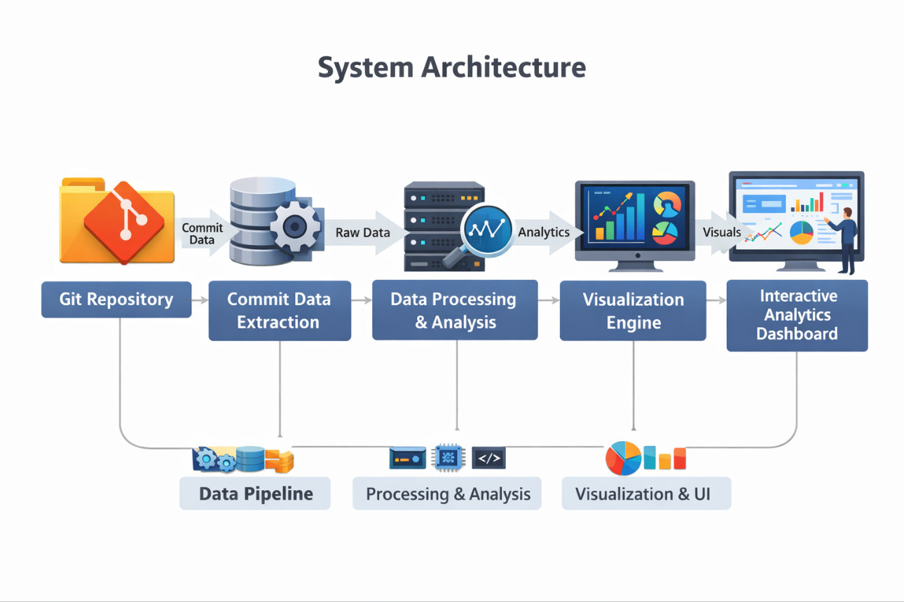
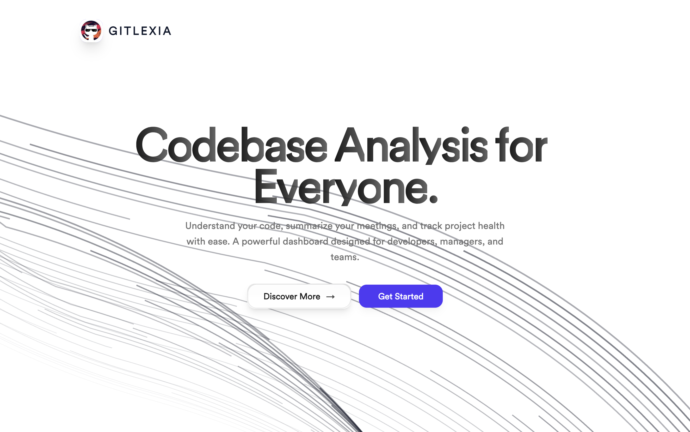
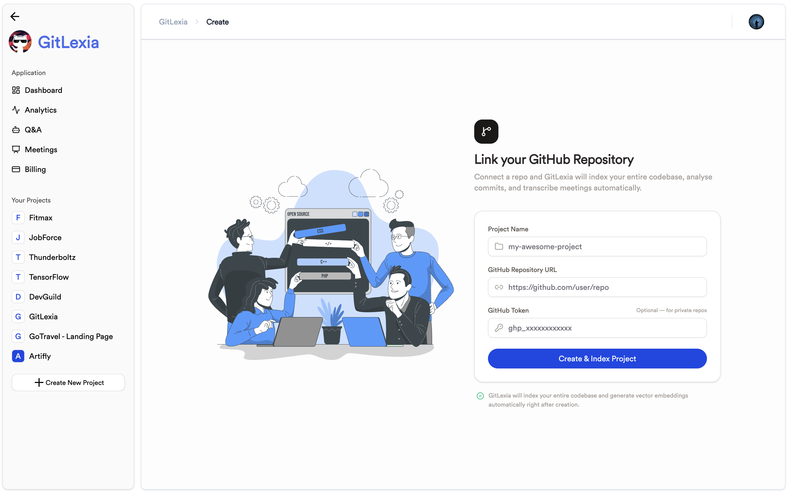
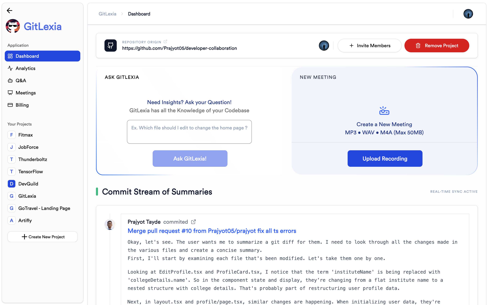
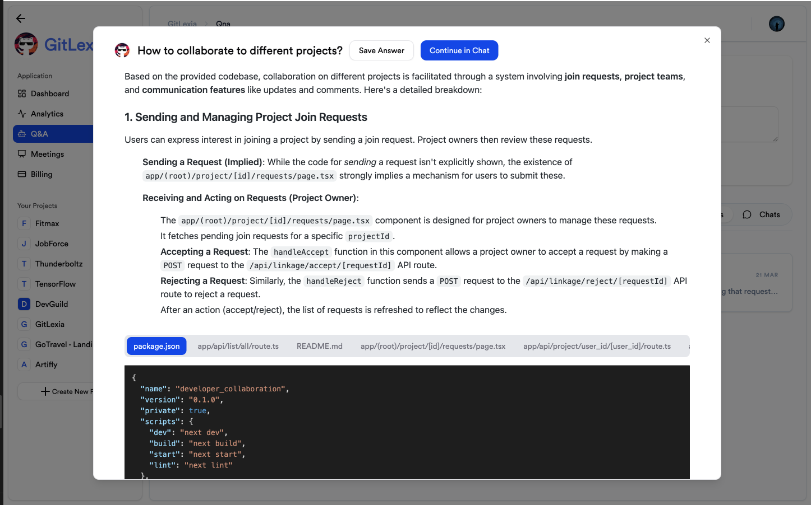
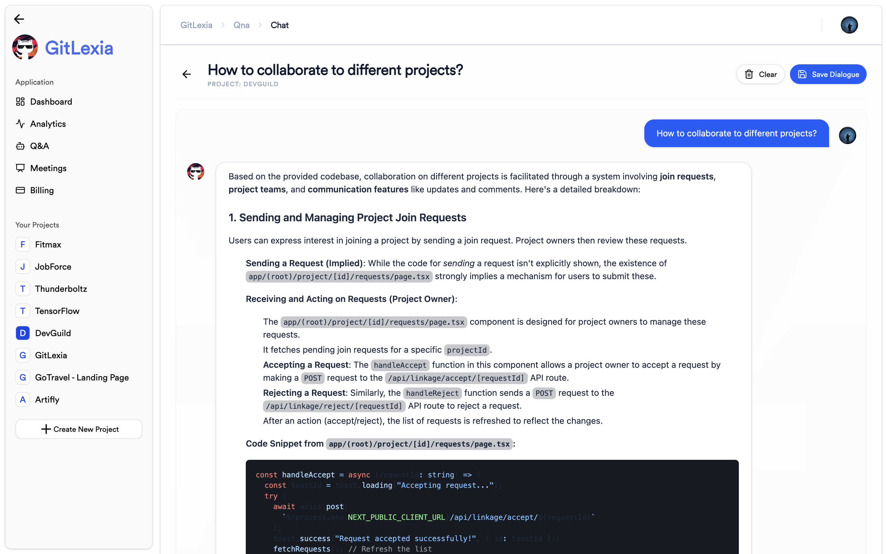
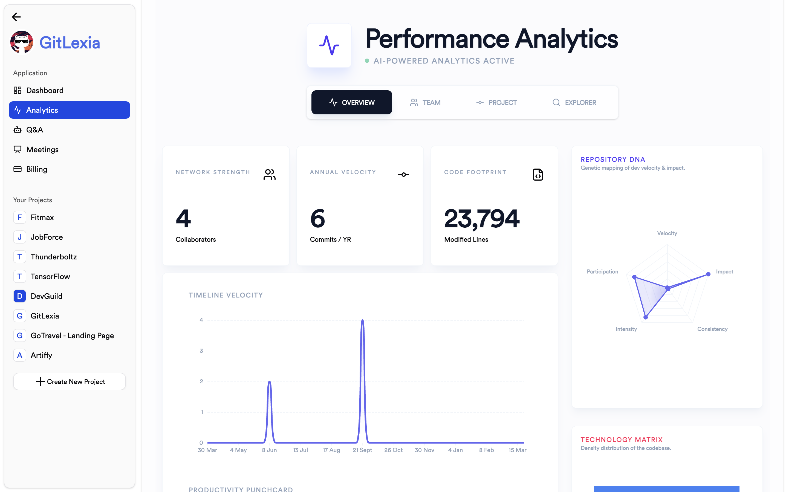
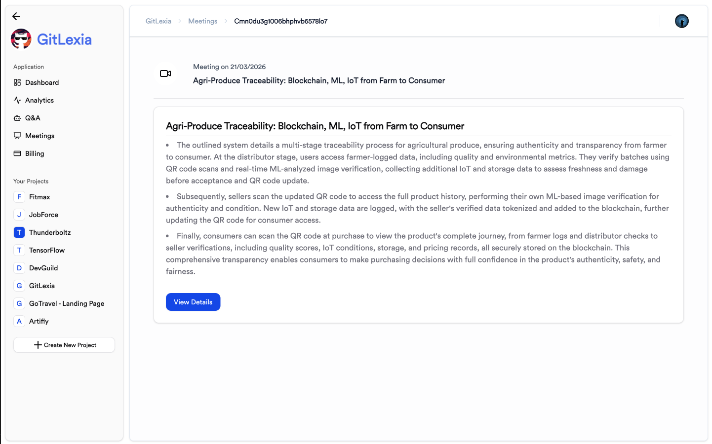

# 🧠 GitLexia

📖 **RAG-powered Git summarization & collaboration intelligence**


---

## 📌 Table of Contents

* 🌍 Overview
* 🎯 Objectives
* ✨ Features
* 🏗 System Architecture
* ⚙️ Installation
* ▶️ Running the Project
* 📖 Usage
* 🛠 Tech Stack
* 📂 Project Structure
* 📊 Input Data
* 🖼 Screenshots
* 🚀 Future Improvements
* 🤝 Contributing

---

# 🌍 Overview

**GitLexia** is an intelligent web platform that uses **Retrieval-Augmented Generation (RAG)** to summarize Git repositories, surface meaningful insights from commit history, and enhance collaboration across engineering teams.

Modern software projects accumulate thousands of commits, pull requests, and code changes. Understanding the *story* behind a repository — who built what, why decisions were made, and how the codebase evolved — is increasingly difficult with traditional tools.

GitLexia bridges that gap by combining **semantic search over your Git history** with **AI-powered summarization**, turning your repository into a conversational knowledge base — right inside a fast, full-stack Next.js application.

👨‍💻 **Who is this for?**

* Developers onboarding to a new codebase
* Open-source maintainers tracking contribution health
* Engineering managers seeking project-level summaries
* Researchers studying software evolution
* Teams wanting intelligent collaboration insights

💡 Ask GitLexia anything about your repo — and get a grounded, context-aware answer backed by your actual commit history.

---

# 🎯 Objectives

#### ✔ Enable natural language Q&A over Git repository history
#### ✔ Automatically summarize commit activity using RAG pipelines
#### ✔ Surface contributor patterns and collaboration insights
#### ✔ Process and transcribe meeting recordings for action items
#### ✔ Provide a conversational interface for repository exploration
#### ✔ Reduce the cognitive load of understanding large codebases

---

# ✨ Features

## 🤖 RAG-Powered Git Summarization

Ask questions like *"What changed in authentication last month?"* or *"Who owns the payments module?"* and get grounded, cited answers from your commit history.

* Semantic search over commit messages and code
* AI-generated summaries via Google Gemini
* Context-aware Q&A anchored to real commits
* Code reference highlighting with file-level context

---

## 📊 Analytics Dashboard

Understand contributor behavior and repository evolution at a glance.

* Contributor activity charts and timelines
* Language distribution across the codebase
* Hourly, daily, and monthly activity patterns
* Repository radar and health overview
* AI-generated project suggestions

---

## 🎙 Meeting Intelligence

Upload team meeting recordings and let GitLexia extract the signal.

* Audio transcription via AssemblyAI
* AI-generated issue extraction from meetings
* Meeting cards and issue lists per session
* Connects meeting context to repository activity

---

## 👥 Team Collaboration

Built for teams from the ground up.

* Invite team members to projects
* Shared project workspace per repository
* Contributor filtering and individual analytics
* Contributor gists — AI summaries per team member

---

## 💬 Q&A Interface

Ask anything about your codebase in plain English.

Examples:
- *"Summarize this week's changes"*
- *"What modules did Alice work on most?"*
- *"When was the last major refactor?"*
- *"Explain the billing integration"*

---

## 💳 Billing & Credits

* Razorpay-powered credit system
* Usage-based access to AI features
* Billing dashboard for managing credits

---

# 🏗 System Architecture

GitLexia is a full-stack Next.js application built on the **T3 Stack** — no separate Python backend.

```
GitHub Repository URL
        │
        ▼
  GitHub Loader (Octokit)
        │
        ▼
  Commit & Code Extraction
        │
        ▼
  Gemini AI — Embeddings & Summarization
        │
        ▼
  Prisma ORM ──► PostgreSQL (Vector Store + App Data)
        │
        ▼
  tRPC API Layer
        │
        ▼
  Next.js Frontend (App Router)
        │
        ├── Dashboard (Commit Log, Q&A, Team)
        ├── Analytics (Charts, Patterns, Radar)
        ├── Meetings (Upload, Transcribe, Issues)
        └── Billing (Razorpay Credits)
```

```

```

Key architectural decisions:

- 1️⃣ **T3 Stack** — Next.js + tRPC + Prisma + Tailwind, all in one TypeScript monorepo
- 2️⃣ **Gemini AI** — handles embeddings for RAG and commit/code summarization
- 3️⃣ **AssemblyAI** — meeting audio transcription pipeline
- 4️⃣ **Firebase** — file storage for meeting uploads
- 5️⃣ **Clerk** — authentication and user management
- 6️⃣ **Razorpay** — billing and credit management

---

# ⚙️ Installation

## 1️⃣ Clone the Repository

```bash
git clone https://github.com/adarshthakare/gitlexia.git
cd bluebit-team-nexus
```

---

## 2️⃣ Install Dependencies

```bash
npm install
```

---

## 3️⃣ Configure Environment Variables

```bash
cp .env.example .env
```

Fill in the required values:

```env
# Database
DATABASE_URL=your_postgresql_connection_string

# Clerk (Auth)
NEXT_PUBLIC_CLERK_PUBLISHABLE_KEY=your_clerk_publishable_key
CLERK_SECRET_KEY=your_clerk_secret_key

# GitHub
GITHUB_TOKEN=your_github_token

# Google Gemini
GEMINI_API_KEY=your_gemini_api_key

# AssemblyAI
ASSEMBLYAI_API_KEY=your_assemblyai_api_key

# Firebase
NEXT_PUBLIC_FIREBASE_API_KEY=your_firebase_api_key
# ...other Firebase config vars

# Razorpay
RAZORPAY_KEY_ID=your_razorpay_key_id
RAZORPAY_KEY_SECRET=your_razorpay_key_secret
NEXT_PUBLIC_RAZORPAY_ID=razorpay_id
RAZORPAY_WEBHOOK_SECRET=your_webhook_secret
```

---

## 4️⃣ Set Up the Database

Push the Prisma schema to your database:

```bash
npx prisma db push
```

Or run migrations:

```bash
npx prisma migrate dev
```

Optionally inspect your data with Prisma Studio:

```bash
npx prisma studio
```

---

# ▶️ Running the Project

```bash
npm run dev
```

Open in browser:

```
http://localhost:3000
```

---

# 📖 Usage

#### 1️⃣ Sign up or sign in via Clerk authentication
#### 2️⃣ Create a new project and link a GitHub repository URL
#### 3️⃣ GitLexia indexes your commit history and generates embeddings
#### 4️⃣ Explore the dashboard — view commit logs, ask questions, invite teammates
#### 5️⃣ Check the Analytics tab for contributor insights and activity patterns
#### 6️⃣ Upload a meeting recording to extract issues and action items
#### 7️⃣ Use credits to unlock AI-powered Q&A and summarization features

---

# 🛠 Tech Stack

### 🎨 Frontend
* **Next.js 14** (App Router)
* **React**
* **Tailwind CSS**
* **shadcn/ui** — component library
* **Recharts / Chart.js** — data visualization

### ⚙️ Backend & API
* **tRPC** — end-to-end typesafe API
* **Prisma ORM** — database access layer
* **PostgreSQL** — primary database (with vector support)
* **Next.js API Routes** — meeting processing endpoint

### 🤖 AI & RAG
* **Google Gemini** — LLM summarization + embeddings
* **AssemblyAI** — meeting audio transcription
* **Octokit / GitHub Loader** — repository data extraction

### 🔐 Auth & Infra
* **Clerk** — authentication and user management
* **Firebase** — file storage for meeting uploads
* **Razorpay** — billing and credits

---

# 📂 Project Structure

```
gitlexia/
│
├── prisma/
│   └── schema.prisma              ← Database schema
│
├── src/
│   ├── app/
│   │   ├── (protected)/
│   │   │   ├── analytics/         ← Charts, contributor insights, radar
│   │   │   ├── dashboard/         ← Commit log, Q&A, team management
│   │   │   ├── meetings/          ← Upload, transcribe, issue extraction
│   │   │   ├── billing/           ← Credit management
│   │   │   ├── create/            ← New project creation
│   │   │   └── qna/               ← Q&A interface
│   │   ├── api/
│   │   │   └── process-meeting/   ← Meeting processing endpoint
│   │   ├── sign-in/ & sign-up/    ← Clerk auth pages
│   │   └── page.tsx               ← Landing page
│   │
│   ├── components/ui/             ← shadcn/ui component library
│   │
│   ├── lib/
│   │   ├── gemini.ts              ← AI summarization & embeddings
│   │   ├── github.ts              ← GitHub API integration
│   │   ├── github-loader.ts       ← Commit & code extraction
│   │   ├── github-stats.ts        ← Repository statistics
│   │   ├── assembly.ts            ← AssemblyAI transcription
│   │   ├── firebase.ts            ← File storage
│   │   └── razorpay.ts            ← Billing integration
│   │
│   ├── server/
│   │   └── api/routers/           ← tRPC routers (project, post)
│   │
│   └── hooks/                     ← Custom React hooks
│
└── public/                        ← Static assets
```


---

# 📊 Input Data

GitLexia ingests the following from connected repositories:

* 👤 Commit author and metadata
* 🕒 Commit timestamps
* 📂 Modified files and diffs
* 📝 Commit messages
* 🔢 Contributor frequency and volume
* 🎙 Meeting audio files (via Firebase upload)

All repository data is embedded via Gemini and stored in PostgreSQL for semantic retrieval.

---

# 🖼 Screenshots

```







```

---

# 🚀 Future Improvements

- ✨ Pull request and issue summarization
- ✨ Slack / Notion integration for sharing summaries
- ✨ File-level contribution and ownership visualization
- ✨ Repository health score and risk indicators
- ✨ Real-time GitHub webhook indexing
- ✨ Multi-repository cross-project Q&A
- ✨ GitLab and Bitbucket support
- ✨ Team collaboration graph and knowledge silo detection

---

# 🤝 Contributing

1️⃣ Fork the repository

```bash
git checkout -b feature-name
git commit -m "Add new feature"
git push origin feature-name
```

2️⃣ Open a Pull Request

---

## What's next? How do I make an app with this?

We try to keep this project as simple as possible, so you can start with just the scaffolding we set up for you, and add additional things later when they become necessary.

If you are not familiar with the different technologies used in this project, please refer to the respective docs:

* [Next.js](https://nextjs.org/docs)
* [tRPC](https://trpc.io/docs)
* [Prisma](https://www.prisma.io/docs)
* [Tailwind CSS](https://tailwindcss.com/docs)
* [Clerk](https://clerk.com/docs)
* [T3 Stack](https://create.t3.gg/)

## How do I deploy this?

Follow the deployment guides for [Vercel](https://create.t3.gg/en/deployment/vercel), [Netlify](https://create.t3.gg/en/deployment/netlify), and [Docker](https://create.t3.gg/en/deployment/docker) for more information.

---

# ⭐ Support the Project

⭐ **Star the repository**
🍴 **Fork the project**
🤝 **Contribute improvements**

---

💻 Built with passion for **developer productivity, AI-powered tooling, and smarter collaboration.**
